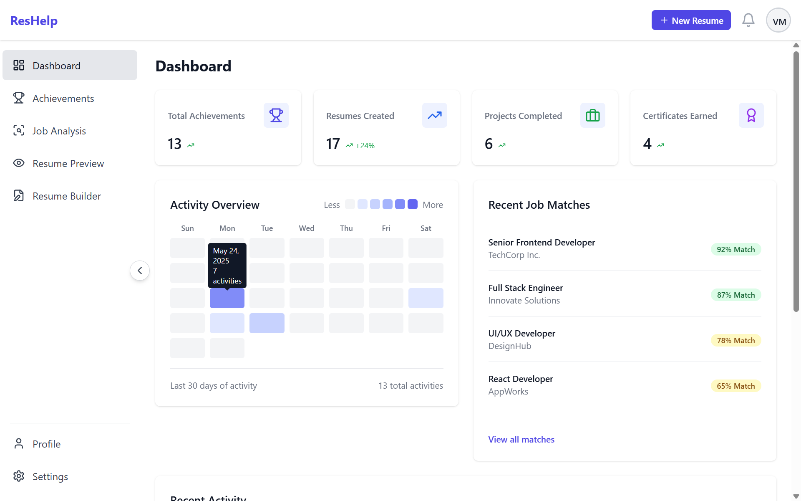
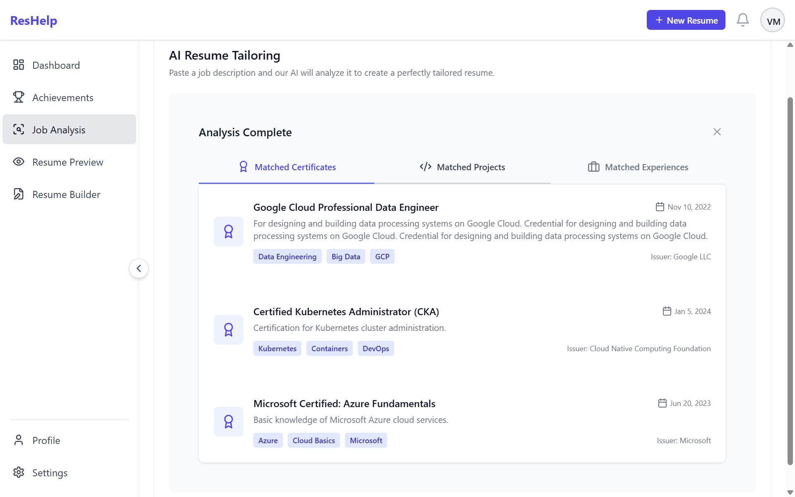

# 🚀 ResHelp – Your AI-Powered Resume Wingman

**ResHelp** is your all-in-one platform to _supercharge_ your career game. From organizing your achievements to generating tailored resumes and analyzing job descriptions with AI, ResHelp is built to make job hunting smarter, faster, and totally hassle-free.

---

## 🔥 Why ResHelp?

Because you shouldn’t spend hours fiddling with your resume. ResHelp brings together achievement management, AI smarts, and beautiful resume generation — all in one sleek platform.

---

## ✨ Key Features

- 🔐 **Multi-Provider Auth**
  Login via Email/Password, Google, GitHub, or LinkedIn

- 🧭 **Intuitive Onboarding**
  Step-by-step onboarding to get started fast

- 📊 **Smart Dashboard**
  Visualize stats, activity heatmaps, and more

- 🏆 **Achievement Vault**
  Manage **Certificates**, **Projects**, and **Experiences** — with GitHub repo import

- 🧠 **AI-Powered JD Analyzer**
  Upload job descriptions and get matching achievements

- 🧱 **Resume Builder**
  Build LaTeX-based resumes from your actual data (PDF generation supported)

- 👤 **User Profile**
  Manage personal info and preferences

- 📄 **Static Pages**
  About, Contact, and more

---

## 🖼️ Screenshots

Here’s a quick look at ResHelp in action:

| Dashboard                               | Achievement Manager                                           | Resume Builder                                      |
| --------------------------------------- | ------------------------------------------------------------- | --------------------------------------------------- |
|  |  |  |

| GitHub Import                                     | JD Tailoring                                      | Suggestions                                 |
| ------------------------------------------------- | ------------------------------------------------- | ------------------------------------------- |
|  |  |  |

| Experiences                                           | User Profile                                    |
| ----------------------------------------------------- | ----------------------------------------------- |
|  |  |

---

## 🛠️ Tech Stack

- **Frontend:** React.js
- **Backend:** Node.js + Express
- **Database:** MongoDB
- **Authentication:** Passport.js + OAuth (Google, GitHub, LinkedIn)
- **AI Layer:** Custom NLP-based achievement-job relevance matching
- **Resume Engine:** LaTeX-powered for high-quality PDF resumes

---

## ⚙️ Getting Started

1. **Clone the Repo**

   ```bash
   git clone https://github.com/lalith17/reshelp.git
   cd reshelp
   ```

2. **Install Backend**

   ```bash
   cd backend
   npm install
   ```

3. **Install Frontend**

   ```bash
   cd ../frontend
   npm install
   ```

4. **Configure Environment Variables**
   Add `.env` files in `frontend` and `backend` with:

   - MongoDB URI
   - OAuth credentials
   - AI/Resume API keys (if applicable)

5. **Run the App**
   Backend:

   ```bash
   cd backend
   npm run dev
   ```

   Frontend:

   ```bash
   cd ../frontend
   npm start
   ```

---

## 🎯 How It Works

1. Sign up and onboard
2. Upload or import your achievements
3. Analyze JDs with AI
4. Build a stunning, job-ready resume
5. Export it — done!

---

## 🔭 Future Scope

- 📄 More LaTeX templates
- 🧠 Smarter AI matching using context
- 📁 Resume versioning + sharing
- 🏷️ Skill auto-tagging
- ⚡ Enhanced UX and mobile experience
- 🤖 AI Chat Assistant:
A personalized, intelligent chatbot that guides users through job applications, answers context-aware questions, and helps fill out resumes and forms based on the user’s data — like having a career coach in your pocket!

---

## 🤝 Contributing

Want to improve ResHelp? PRs and feedback are welcome!

---

## 📄 License

MIT License — see [LICENSE](LICENSE)

---

## 📬 Contact

**Megha Sai Lalith Vallamkonda**
📧 [mslalith17@gmail.com](mailto:mslalith17@gmail.com)
🔗 [github.com/lalith17](https://github.com/lalith17)
